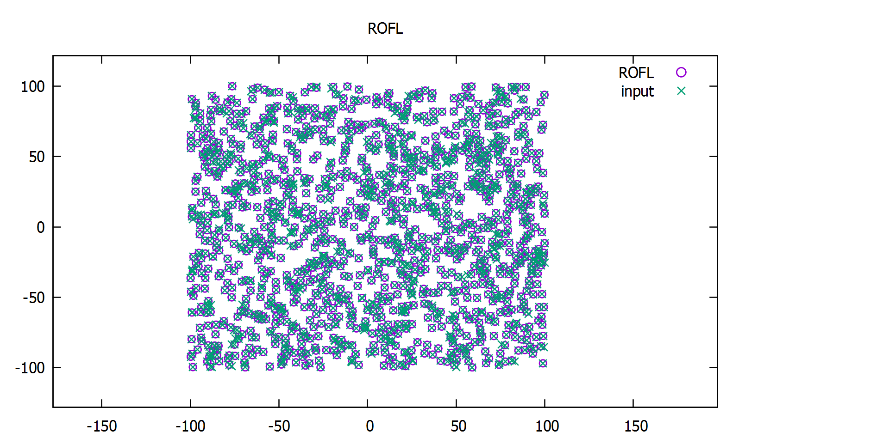

# TNN - ROLF
ROLF implementation as a part of Technical Neural Networks course at University of Bonn

## Compilation:
```sh
cd build
cmake ..
make
```

To run the program, simply call the executable.
```sh
./TNN-D
```

## Plotting the results
There are one task using randomly generated data.

To plot the results using gnuplot:
for the task
```sh
gnuplot> load "plotROLF.gnuplot"
```
## example
### ROLF



